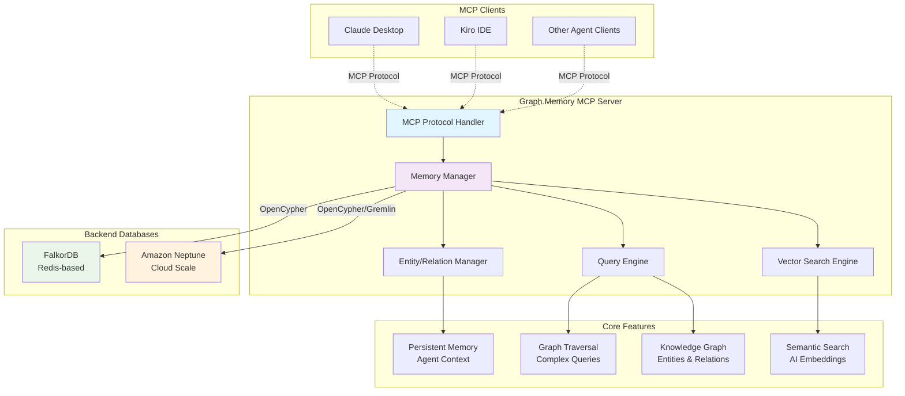

# Groot DataKG MCP Server - A Data Librarian's Desk

Model Context Protocol (MCP) server for enabling data extraction and context retrival for agents, stored in a knowledge graph using Amazon Neptune or FalkorDB. This is an experimental data modeller tool enabling semantic search to assit Agent to be a data librarian.

## Architecture Overview



### Key Components

- **MCP Protocol Handler**: Manages communication with MCP clients using standard protocol
- **Memory Manager**: Core orchestration layer handling memory operations and backend selection
- **Vector Search Engine**: AI-powered semantic search using sentence transformers (384-dim embeddings)
- **Query Engine**: Executes OpenCypher and Gremlin queries against graph databases
- **Entity/Relation Manager**: Handles CRUD operations for graph entities and relationships

### Data Flow

1. **MCP Clients** (Claude Desktop, Kiro IDE, etc.) connect via standard MCP protocol
2. **Memory operations** are processed through the Memory Manager
3. **Semantic search** uses AI embeddings for conceptual entity matching
4. **Graph queries** are executed against Neptune (cloud) or FalkorDB (local/Redis)
5. **Results** are returned through the MCP protocol to clients

## Prerequisites

1. Install `uv` from [Astral](https://docs.astral.sh/uv/getting-started/installation/) or the [GitHub README](https://github.com/astral-sh/uv#installation)
2. Install Python using `uv python install 3.12`

## Installation

### Local Development

```bash
# Clone the repository
git clone <repository-url>
cd ws-memory-mcp-server

# Install dependencies
uv sync

# Run with Neptune backend (full access mode)
uv run ws-memory-mcp-server --backend neptune --endpoint "neptune-db://your-cluster-endpoint"

# Run with FalkorDB backend (full access mode)
uv run ws-memory-mcp-server --backend falkordb --falkor-host localhost --falkor-port 6379

# Run in read-only mode
uv run ws-memory-mcp-server --backend falkordb --falkor-host localhost --falkor-port 6379 --mode read

# Run with SSE transport and custom logging
uv run ws-memory-mcp-server --backend falkordb --falkor-host localhost --falkor-port 6379 --sse --log-level DEBUG --log-file ./logs/mcp-server.log
```

### MCP Client Configuration

Below are examples of how to configure your MCP client for different backends:

#### Neptune Backend

```json
{
  "mcpServers": {
    "Neptune Memory": {
      "command": "uvx",
      "args": [
        "ws-memory-mcp-server",
        "--backend", "neptune",
        "--endpoint", "neptune-db://your-cluster-endpoint"
       ],
      "env": {
        "FASTMCP_LOG_LEVEL": "INFO"
      }
    }
  }
}
```

#### FalkorDB Backend

```json
{
  "mcpServers": {
    "FalkorDB Memory": {
      "command": "uvx",
      "args": [
        "ws-memory-mcp-server",
        "--backend", "falkordb",
        "--falkor-host", "localhost",
        "--falkor-port", "6379",
        "--graph-name", "memory"
       ],
      "env": {
        "FASTMCP_LOG_LEVEL": "INFO"
      }
    }
  }
}
```

## Backend Configuration

### Neptune

When specifying the Neptune Endpoint the following formats are expected:

For Neptune Database:
`neptune-db://<Cluster Endpoint>`

For Neptune Analytics:
`neptune-graph://<graph identifier>`

### FalkorDB

FalkorDB can be run locally using Docker:

```bash
# Run FalkorDB instance
docker run --rm -p 6379:6379 falkordb/falkordb
```

Or use [FalkorDB Cloud](https://app.falkordb.cloud) for a managed instance.

## Features

The MCP Server provides an agentic memory capability stored as a knowledge graph with support for:

- **Multiple Backends**: Choose between Amazon Neptune (cloud-scale) or FalkorDB (lightweight, Redis-based)
- **Persistent Memory**: Store agent memories as entities and relationships
- **Knowledge Graph**: Leverage graph database capabilities for complex relationship modeling
- **MCP Integration**: Standard MCP server interface for seamless integration with MCP clients
- **Search & Query**: Full-text search and graph traversal capabilities
- **Observation Tracking**: Store and manage observations about entities over time

## Command Line Options

### Common Options
- `--backend`: Database backend (`neptune` or `falkordb`, default: `neptune`)
- `--mode`: Server mode (`read`, `write`, or `full`, default: `full`)
  - `read`: Read-only access to the knowledge graph
  - `write`: Write-only access for creating and modifying data  
  - `full`: Complete access with all read and write operations
- `--sse`: Enable SSE transport
- `--port`: Server port (default: 8888)
- `--log-level`: Logging level (DEBUG, INFO, WARNING, ERROR, CRITICAL, default: INFO)
- `--log-file`: Path to log file for persistent logging

### Neptune-Specific Options
- `--endpoint`: Neptune endpoint (required for Neptune)
- `--use-https`: Use HTTPS for Neptune connection (default: True)
- `--no-https`: Disable HTTPS for Neptune connection

### FalkorDB-Specific Options
- `--falkor-host`: FalkorDB host (default: localhost)
- `--falkor-port`: FalkorDB port (default: 6379)
- `--falkor-password`: FalkorDB password
- `--falkor-ssl`: Use SSL for FalkorDB connection
- `--graph-name`: Graph name for FalkorDB (default: memory)